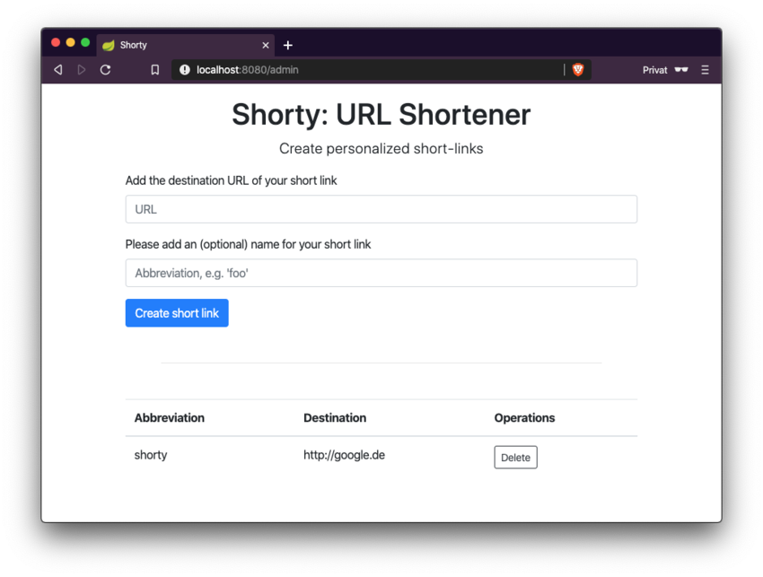

= Shorty: The URL Shortener
:experimental:
:icons: font
:icon-set: octicon
:source-highlighter: rouge
ifdef::env-github[]
:tip-caption: :bulb:
:note-caption: :information_source:
:important-caption: :heavy_exclamation_mark:
:caution-caption: :fire:
:warning-caption: :warning:
endif::[]

This is a URL Shortener written in Java with the only purpose to create shortened urls, which are stored in a Redis-Database.
The shortened links can then be used to provide a simpler access to complicated URLs.

== Installation

You need a JDK, Gradle and yarn for this project.

Download the external dependencies with

    yarn install

As a requirement a Redis-Database is necessary.
Start one with

    docker run -p 6379:6379 redis:alpine

Then start the application:

    gradle bootRun

== Usage

Start the application, add a short link.
Then you can access it via
http://localhost:8080/<your-short-link>

== Contribution

* Write in English language
* Add https://github.com/n2o/url-shortener/issues[Issues] and assign yourself to the issue when you want wo work on it
* Create https://github.com/n2o/url-shortener/pulls[Pull Requests]
* Read the Code of Conduct