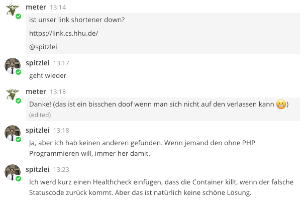
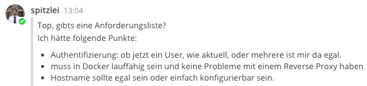

= Softwareentwicklung im Team: Übung 6
21.11.2019
:experimental:
:icons: font
:icon-set: octicon
:source-highlighter: rouge
ifdef::env-github[]
:tip-caption: :bulb:
:note-caption: :information_source:
:important-caption: :heavy_exclamation_mark:
:caution-caption: :fire:
:warning-caption: :warning:
endif::[]

=== Webanwendung mit Redis

In den letzten Wochen haben wir uns einiges rund um die Entwicklung von
Webanwendungen in Java angesehen. Es wurden verschiedene Tools und Frameworks
betrachtet, die wir dazu nutzen können. Heute wollen wir dies zusammenfassend in
einem Projekt nutzen. 

Eine Neuigkeit gibt es für Sie heute dennoch. Wir werden diesmal die Datenbank
https://redis.io/[Redis] verwenden. Redis ist ein Key-Value-Store, speichert
also Schlüssel-Wert-Paare, und genügt für unsere Anforderungen. Sie müssen kein
Passwort für die Datenbank setzen.

== Link-Shortener

Link-Shortener werden verwendet, um lange und / oder unverständliche Links zu
einem kurzen Link zusammenzufassen und gleichzeitig einen kurzen prägnanten und
aussprechbaren Namen zu vergeben. So sind beispielsweise die Videos dieser
Veranstaltung in der Mediathek unter folgender URL erreichbar:

https://mediathek.hhu.de/playlist/390

Das kann man sich nun merken, oder man nutzt Tools, um den Link verständlicher
zu machen, beispielsweise so:

https://link.cs.hhu.de/pp2videos

Nun gibt es das Problem, dass das Tool zum Linkkürzen, welches an unserem
Institut verwendet wird, in PHP geschrieben ist und dazu auch noch unzuverlässig
läuft. Folgenden Chatverlauf gab es diese Woche:

Zeit also, dass wir unserem Admin unter die Arme greifen und ihm eine
zuverlässige Webanwendung entwickeln, die diese einfache Aufgabe für uns
übernimmt!

=== Aufgaben

Es gibt von unserem Admin folgende Anforderungen:

Authentifizierung lösen wir über HTTP Basic Auth, heißt unsere Anwendung bekommt
davon nichts mit. Punkt abgehakt. Den Rest schauen wir uns an.

==== 1. Aufgabe: Docker Compose

Zunächst starten wir die Redis-Datenbank. Dafür verwenden wir
Docker und packen die Konfiguration direkt in eine Docker Compose
Konfigurationsdatei.

NOTE: Erstellen Sie eine `docker-compose.yml`-Datei, in der das Image
`redis:alpine` gestartet wird und der Redis-Port 6379 an den Host gebunden wird.
Der Redis-Service soll `redis` heißen.

==== 2. Aufgabe: Implementieren Sie die Anwendung mit Spring Boot

Die Anwendung ist bereits so konfiguriert, dass sie eine Verbindung zur
Redis-Datenbank aufbaut, sofern diese gestartet ist.

NOTE: Starten Sie die Redis-Datenbank. Verwenden Sie dafür die
Konfigurationsdatei aus Aufgabe 1.

Unsere Anwendung soll nun über einen Controller verfügen, der:

* unter dem Pfad `/` eine Liste aller vorhandenen Verkürzungen anzeigt, sowie
* ein Webformular anzeigt, mit dem man per `POST`-Request eine Abkürzung
(`abbreviation`) und eine URL (`url`) angeben kann.

NOTE: Erstellen Sie zunächst eine Entität `Link`, welche mit
`@RedisHash("Link")` annotiert ist und die Felder `abbreviation` (Abkürzung) und
`url` (Ziel-URL) hat.

NOTE: Erstellen Sie einen Controller mit den oben genannten Eigenschaften.

NOTE: Schreiben Sie ein Template `index.html`. Verwenden Sie das aus der
Vorlesung bekannte "Thymeleaf".

==== 3. CRUD Interface

CRUD steht für **C**reate, **R**ead, **U**pdate und **D**elete, also alle
Basisoperationen, die wir erwarten, wenn wir Entitäten erstellen, lesen,
aktualisieren oder löschen wollen.

NOTE: Implementieren Sie die nötigen Create, Read, Update, Delete Funktionalität
in der Anwendung. Beginnen Sie damit eingetragene Links löschen zu können.
Bestehende Links modifizieren zu können, ist für unsere Anwendung nicht
unbedingt notwendig. Sie können demnach die **U**pdate Funktionalität auslassen,
wenn Sie wollen.

TIP: Es empfiehlt sich die Funktionalität zuerst in Java zu implementieren und
zu schauen, ob sie grob funktioniert. Hierzu ist der `CommandLineRunner` in der
`@SpringBootApplication` annotierten Klasse sehr nützlich. Machen Sie sich erst
danach daran, dem Nutzer eine View zu bauen.

==== Bonusaufgabe: Dockerize Everything!

Anwendungen, die bei uns am Institut für Informatik produktiv laufen, werden in
der Regel per Docker ausgeliefert. Dafür verwenden wir die
https://docs.docker.com/engine/swarm/[Docker Swarm Engine], die Sie in der
Vorlesung wahrscheinlich nicht sehen werden (nur so zur Information am Rande).
Die Anwendungen werden genauso konfiguriert, wie Docker Compose sie auch
verwenden würde. Daher kennen wir schon das passende Format für das Deployment.

Nun muss noch die Spring Boot Anwendung in Docker laufen. Dafür können Sie das
Gradle-Docker-Image verwenden, welches wir schon in einer vorherigen Übung
verwendet haben. Noch besser wäre ein Docker-Multistage-Build, in der im ersten
Schritt die Anwendung kompiliert und in eine Jar-Datei verpackt wird und im
zweiten Schritt die Jar-Datei mit einem passenden JRE ausgeführt wird.

NOTE: Verpacken Sie nun die Spring-Anwendung in ein Docker Image und lassen Sie
es mittels Docker Compose zusammen mit der Datenbank laufen.

TIP: Da alle Dienste nur noch in Containern laufen, müssen Sie den
Datenbank-Host in der `application.properties` von `localhost` zu `redis`
ändern, damit der Redis-Container angesprochen wird.