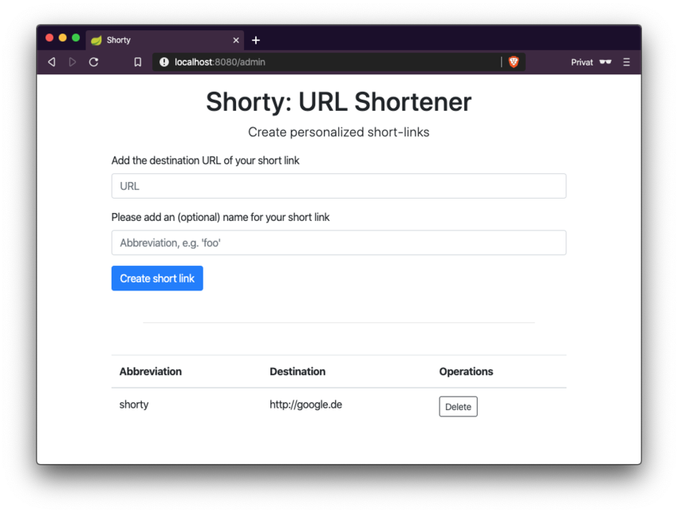

# Shorty — The URL Shortener

[](https://github.com/n2o/url-shortener/pkgs/container/url-shortener)

A simple URL shortener written in Java. Create shortened links, store them in Redis, and redirect visitors to the original URLs.



Only authenticated admins can create or delete short links.

## Installation

> [!NOTE]
> You need **JDK 25+** and **Gradle 8.14+** to build this project.

A running Redis instance is required. Start one with:

```bash
docker run -p 6379:6379 redis:alpine
```

Then start the application:

```bash
./gradlew bootRun
```

## Usage

Open [http://localhost:8080](http://localhost:8080) and log in as an admin.
The default credentials are defined in [`application.properties`](src/main/resources/application.properties).

In the admin menu you can add new short links. Redirect to the original URL by visiting:

```
http://localhost:8080/<your-short-link>
```

## Docker

We automatically build a Docker image for Shorty.

```bash
docker pull ghcr.io/n2o/url-shortener:latest
```

Browse available versions on the [GitHub Container Registry](https://github.com/n2o/url-shortener/pkgs/container/url-shortener).

## Deployment

> [!TIP]
> Copy `skeleton.env` to `production.env` and adjust the values before starting.

Use Docker Compose for a production setup:

```bash
docker compose up
```

This starts a Redis server with persistent storage and exposes the application on port **8080**.

## Contributing

- Write in English
- Open an [Issue](https://github.com/n2o/url-shortener/issues) and assign yourself before working on it
- Create [Pull Requests](https://github.com/n2o/url-shortener/pulls)
- Read and follow the [Code of Conduct](CODE_OF_CONDUCT.md)
